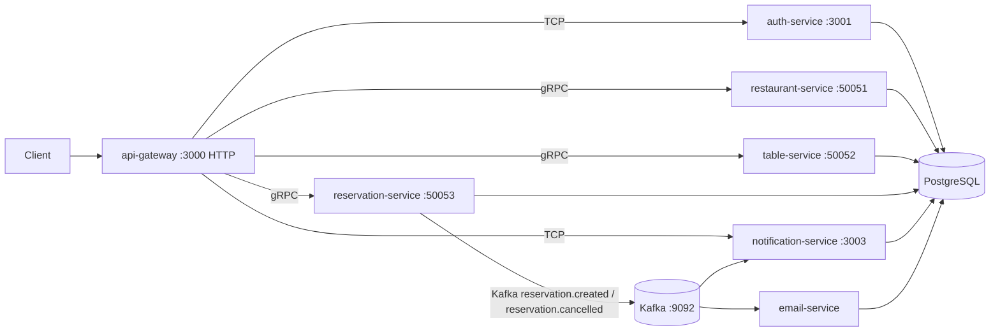

# Restaurant Table Reservation — Project Context

NestJS 12 ESM monorepo. HTTP API gateway fronts auth (TCP), restaurant/table/reservation (gRPC), and notifications (TCP). Reservation create/cancel publishes Kafka events consumed by notification-service and email-service.

## Architecture



| App | Transport | Default port |
| --- | --- | --- |
| `apps/api-gateway` | HTTP + TCP/gRPC clients | 3000 |
| `apps/auth-service` | TCP | 3001 |
| `apps/restaurant-service` | gRPC `restaurant.RestaurantService` | 50051 |
| `apps/table-service` | gRPC `table.TableService` | 50052 |
| `apps/reservation-service` | gRPC `reservation.ReservationService` + Kafka producer | 50053 |
| `apps/notification-service` | TCP + Kafka consumer | 3003 |
| `apps/email-service` | Kafka consumer only | — |

| Library | Alias |
| --- | --- |
| `libs/common` | `@app/common` |
| `libs/database` | `@app/database` |
| `libs/kafka` | `@app/kafka` |

Canonical proto files: `libs/common/src/proto/*.proto`. Kafka topics: `reservation.created`, `reservation.cancelled` (`KAFKA_TOPICS`).

## How to run

```bash
npm install
docker compose up -d          # postgres :5432, kafka :9092
npm run db:push
nest start auth-service --watch
nest start restaurant-service --watch
nest start table-service --watch
nest start reservation-service --watch
nest start notification-service --watch
nest start email-service --watch
nest start api-gateway --watch
```

Env: `DATABASE_URL`, `JWT_SECRET`, `PORT`, `AUTH_SERVICE_HOST/PORT`, `NOTIFICATION_SERVICE_HOST/PORT`, `RESTAURANT_SERVICE_URL`, `TABLE_SERVICE_URL`, `RESERVATION_SERVICE_URL`, `KAFKA_BROKER` or `KAFKA_BROKERS`.

Email service writes rows to `email_logs` and logs to stdout (no SMTP yet). Notification rows go to `notifications`.

## Gateway HTTP API

JWT: `Authorization: Bearer`. Mutations generally require JWT.

Auth: `POST /auth/register`, `POST /auth/login`, `GET /auth/profile`, `POST /auth/validate`.

Restaurants: CRUD `/restaurants`, plus `/restaurants/:id/location`, `/opening-hours`, `/house-rules`.

Floors/tables: `GET|POST /restaurants/:id/floors`, `GET|PUT|DELETE /floors/:floorId`, `GET|POST /restaurants/:id/tables`, `GET|PUT|DELETE /tables/:tableId`, `GET|POST /floors/:floorId/combinations`, `DELETE /combinations/:id`.

Reservations: `POST /reservations` (body `CreateReservationDto`), `GET /reservations`, `GET /reservations/:id`, `POST /reservations/:id/cancel`.

Notifications: `GET /notifications`.

## Domain rules

- No FK from restaurant/table/reservation owner/user ids onto `users`.
- Floors unique per `(restaurantId, floorNumber)`. Tables unique per `(floorId, tableNumber)`. Capacity > 0.
- Reservation create checks table exists, same restaurant, partySize ≤ capacity, no overlapping non-cancelled booking on that table.
- Cancel is allowed only for the reserving `userId` when one is set.
- Kafka producer is best-effort: if the broker is down, reservation still persists and emit is skipped.

## Conventions

- ESM, `.js` import extensions, `@app/*` path aliases.
- gRPC clients: inject `ClientGrpc`, then `getService()` in `onModuleInit`. RPC names match proto (PascalCase in `@GrpcMethod`, camelCase on the client).
- Nest Kafka consumers use `@EventPattern` with the topic string; producer payload is `{ pattern, data }`.
